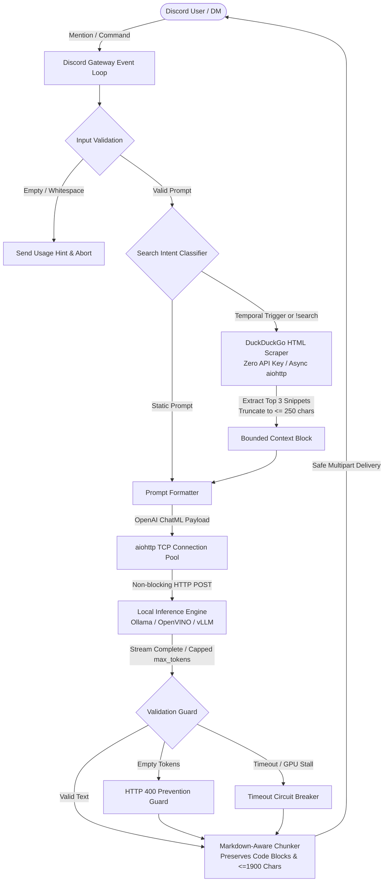

# Local AI Discord Bot

[](https://www.python.org/)
[](https://discordpy.readthedocs.io/)
[](https://ollama.com/)
[](#hardware--vram-budgeting)
[](#zero-api-key-web-scraping-pipeline)
[](LICENSE)

A production-grade, asynchronous Discord bot engineered to run quantized Large Language Models (such as **Google DeepMind's Gemma 2 2B**) locally on consumer hardware under a strict **5GB VRAM ceiling**. 

It interfaces with any local OpenAI-compatible endpoint ([Ollama](https://ollama.com/), [OpenVINO](https://github.com/openvinotoolkit/openvino), [vLLM](https://github.com/vllm-project/vllm), or [LM Studio](https://lmstudio.ai/)) and features a pure-Python, zero-API-key DuckDuckGo scraping engine that automatically extracts real-time snippets for time-sensitive queries without inflating context memory.

---

## Architecture Overview



---

## Hardware & VRAM Budgeting

The bot is calibrated to operate within a **5.0 GB VRAM envelope**, making it suitable for lower-tier GPUs (RTX 3050 4GB/6GB, GTX 1650 4GB, GTX 1060 6GB), budget laptops, and Apple Silicon unified memory (8GB).

### VRAM Allocation Model (Gemma 2 2B Q4_K_M)

| Component | VRAM Footprint | Description |
| :--- | :--- | :--- |
| **Model Weights (Q4_K_M)** | ~ 1.63 GB | 4-bit quantized tensor weights loaded into GPU memory |
| **KV Cache (2048 Context)** | ~ 0.25 GB | Key-Value attention cache for prompt evaluation |
| **CUDA / Driver Overhead** | ~ 0.80 GB | CUDA runtime context and PyTorch/llama.cpp memory buffers |
| **Inference Working Scratch**| ~ 0.20 GB | Intermediate activation tensors during forward pass |
| **Total Peak VRAM** | **~ 2.88 GB** | **Leaves > 2.1 GB of headroom on a 5GB GPU** |

### Verified Local Models

| Model Identifier | Parameter Count | Quantization | Recommended Backend | Disk Space |
| :--- | :--- | :--- | :--- | :--- |
| `gemma2:2b` *(Default)* | 2.6 Billion | Q4_K_M | Ollama / OpenVINO | 1.6 GB |
| `gemma:2b` | 2.5 Billion | Q4_0 | Ollama | 1.4 GB |
| `qwen2.5:1.5b` | 1.5 Billion | Q4_K_M | Ollama / vLLM | 1.0 GB |
| `qwen2.5:3b` | 3.1 Billion | Q4_K_M | Ollama | 1.9 GB |
| `phi3:mini` | 3.8 Billion | Q4_K_M | Ollama / llama.cpp | 2.2 GB |

---

## Key Engineering Highlights

### 1. Connection Pooling & Resource-Bounded I/O
Instead of creating ephemeral HTTP sessions per prompt, the bot manages a persistent `aiohttp.ClientSession` with a `TCPConnector` lifecycle (`setup_hook` and `close`). This eliminates socket churn, keeps DNS caches warm, and minimizes Time-to-First-Token (TTFT).

### 2. Zero-API-Key Web Grounding Pipeline
The built-in `DuckDuckGoScraper` parses DuckDuckGo HTML using `BeautifulSoup` (with `lxml` acceleration). 
* **Zero Cost**: Operates entirely without external API keys or subscription fees.
* **Context Preservation**: Extracts the top 3 snippet results, unwinds redirect links (`uddg`), and caps each snippet to 250 characters. This injects fresh facts (~150 tokens) without exhausting the LLM's limited context window.
* **Automatic Heuristics**: Automatically identifies temporal markers (`today`, `latest`, `price`, `news`, `current`) or triggers on explicit search commands.

### 3. Markdown-Preserving Message Chunker
Discord imposes a hard 2000-character limit per message. Naive substring slicing breaks code fences and corrupts syntax highlighting. The chunking engine tracks markdown fences (````python ... ````) across lines, automatically closing the block in the outgoing chunk and reopening it in the succeeding chunk.

### 4. Robust Validation & Fault Tolerance
* **HTTP 400 Prevention**: Discord rejects empty or whitespace-only messages (`Error 50035`). The bot validates token outputs before network dispatch and substitutes diagnostic fallback text if generation returns empty.
* **GPU Hang Circuit Breaker**: If local hardware stalls, overheats, or pages to system RAM, the client-side timeout halts execution after a configurable threshold (default: 60s) and returns an actionable hardware diagnostic instead of hanging the event loop.

---

## Repository Structure

```text
Local-AI-Discord-Bot/
├── bot/                       # Modular package core
│   ├── __init__.py            # Package metadata & unified public exports
│   ├── __main__.py            # Module entrypoint (python -m bot)
│   ├── config.py              # Centralized environment, persona, & hardware hyperparams
│   ├── client.py              # Bot subclass, lifecycle hooks, commands, & events
│   ├── chunker.py             # Markdown-aware message chunking (<=1900 chars & code fences)
│   ├── scraper.py             # Pure-Python DuckDuckGo HTML scraper & intent detector
│   └── llm.py                 # OpenAI-compatible local LLM client & circuit breaker
├── bot.py                     # Canonical root launcher (python bot.py)
├── requirements.txt           # Production dependencies
├── .env.example               # Environment variables configuration template
├── .gitignore                 # Python, venv, and environment ignores
└── README.md                  # Comprehensive architectural documentation
```

---

## Quickstart Guide

### 1. Prerequisites

* **Python 3.10 or higher** installed.
* **[Ollama](https://ollama.com/)** (or another OpenAI-compatible local server like OpenVINO Model Server).
* A **Discord Bot Token** from the [Discord Developer Portal](https://discord.com/developers/applications).

### 2. Configure Local Inference Server

Install Ollama, start the service, and pull the recommended 2B model:

```bash
# Pull the quantized Gemma 2 2B model (~1.6GB)
ollama pull gemma2:2b

# Verify the local OpenAI-compatible endpoint responds
curl http://localhost:11434/v1/models
```

### 3. Discord Developer Portal Setup

1. Navigate to the [Discord Developer Portal](https://discord.com/developers/applications) and create a **New Application**.
2. Go to the **Bot** tab, click **Add Bot**, and copy the **Bot Token**.
3. Under **Privileged Gateway Intents**, enable **`MESSAGE CONTENT INTENT`** *(Mandatory for prompt parsing)*.
4. Go to **OAuth2** -> **URL Generator**:
   * Scopes: `bot`
   * Bot Permissions: `Send Messages`, `Read Message History`, `Send Messages in Threads`, `Attach Files`
5. Copy the generated invite link and authorize the bot to your server.

### 4. Clone & Environment Configuration

```bash
# Clone the repository
git clone https://github.com/JishnuuUwU/Local-AI-Discord-Bot.git
cd Local-AI-Discord-Bot

# Create and activate a virtual environment
# Windows:
python -m venv .venv
.venv\Scripts\activate

# macOS / Linux:
python3 -m venv .venv
source .venv/bin/activate

# Install dependencies
pip install -r requirements.txt
```

### 5. Configure `.env`

Copy the provided template and supply your Discord token:

```bash
# Windows:
copy .env.example .env

# macOS / Linux:
cp .env.example .env
```

Edit `.env`:

```env
DISCORD_BOT_TOKEN=your_actual_discord_bot_token_here
LOCAL_LLM_URL=http://localhost:11434/v1
MODEL_NAME=gemma2:2b
MAX_TOKENS=512
```

### 6. Launch the Bot

```bash
python bot.py
```

Or run directly via module:

```bash
python -m bot
```

---

## Configuration Reference

All settings can be configured via environment variables or the `.env` file:

| Parameter | Type | Default | Description |
| :--- | :--- | :--- | :--- |
| `DISCORD_BOT_TOKEN` | `str` | *None* *(Required)* | Authentication token obtained from Discord Developer Portal. |
| `LOCAL_LLM_URL` | `str` | `http://localhost:11434/v1` | Base URL for OpenAI-compatible endpoint (`/v1` or `/chat/completions`). |
| `MODEL_NAME` | `str` | `gemma2:2b` | Local model tag loaded in the inference server. |
| `MAX_TOKENS` | `int` | `512` | Token generation ceiling (prevents infinite loops and VRAM strain). |
| `TEMPERATURE` | `float` | `0.7` | Sampling temperature (`0.0` for deterministic, `1.0` for creative). |
| `TOP_P` | `float` | `0.9` | Nucleus sampling probability cutoff. |
| `INFERENCE_TIMEOUT_SECONDS` | `float` | `60.0` | Client timeout before breaking on GPU compute stall. |
| `COMMAND_PREFIX` | `str` | `!` | Prefix for bot commands. |
| `SEARCH_ENABLED` | `bool` | `true` | Toggles the zero-key DuckDuckGo search context pipeline. |
| `SEARCH_MAX_RESULTS` | `int` | `3` | Maximum number of search snippets injected into context. |
| `SEARCH_TIMEOUT_SECONDS` | `float` | `5.0` | Timeout threshold for DuckDuckGo HTML scraping requests. |
| `MAX_SNIPPET_LENGTH` | `int` | `250` | Maximum character length per extracted search snippet. |
| `SYSTEM_PERSONA` | `str` | *(Built-in)* | System prompt defining bot tone, constraints, and instructions. |

---

## Interacting with the Bot

The bot supports multiple interaction workflows:

| Method | Syntax | Behavior |
| :--- | :--- | :--- |
| **Mention** | `@Bot <prompt>` | Generates a response. Triggers web search if temporal keywords are detected. |
| **Direct Message** | Send a DM | Fully supported. Keeps conversations private and isolated. |
| **`!ask` Command** | `!ask <prompt>` | Queries the local model directly without requiring mentions. |
| **`!search` Command** | `!search <query>` | Forces DuckDuckGo web search and synthesizes top snippets into the prompt. |
| **`!status` Command** | `!status` | Reports live backend connectivity, roundtrip latency, active model, and uptime. |
| **`!persona` Command** | `!persona` | Displays the active system persona and operational rules. |
| **`!help` Command** | `!help` | Displays command syntax and interaction instructions. |

---

## Privacy & Security Verification

* **Zero Cloud Egress**: LLM inference runs 100% on localhost (`127.0.0.1`). Prompts, server tokens, and generations never leave your machine.
* **Ephemeral In-Memory Execution**: The bot does not store chat history in external databases or disk caches.
* **Direct Web Scraping**: When web search is triggered, requests are sent directly to DuckDuckGo's public HTML interface with anonymized headers; no third-party search APIs receive or track user queries.

---

## Troubleshooting

| Issue / Error | Root Cause | Solution |
| :--- | :--- | :--- |
| `discord.errors.HTTPException: 400 Bad Request (error code: 50035)` | Attempted to send an empty or whitespace-only message. | Built-in validation catches this automatically. Ensure code has not been modified to bypass the empty check. |
| `aiohttp.ClientConnectorError: Cannot connect to host localhost:11434` | Ollama or inference backend service is not running. | Run `ollama serve` or ensure your backend container is active on port 11434. |
| `Inference Error (HTTP 404): Model 'gemma2:2b' not found` | The model has not been downloaded to the local server. | Execute `ollama pull gemma2:2b` in your terminal. |
| Bot logs in but does not reply to messages | **Privileged Gateway Intents** are disabled in Discord Portal. | Go to [Discord Portal](https://discord.com/developers/applications) -> Bot -> Enable **`MESSAGE CONTENT INTENT`**. |
| `Inference Timeout: Local backend took longer than 60s` | GPU ran out of VRAM and offloaded layers to CPU/RAM swap. | Lower `MAX_TOKENS` in `.env` (e.g. `256`), or use a smaller quantized model (`qwen2.5:1.5b`). |

---

## License

This project is licensed under the [Apache-2.0 License](LICENSE).
